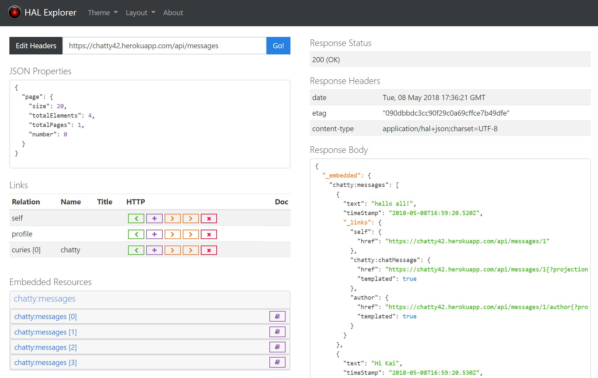

= HAL Explorer

image:https://travis-ci.org/toedter/hal-explorer.svg?branch=master[Build Status, link="https://travis-ci.org/toedter/hal-explorer"]
image:https://img.shields.io/badge/license-MIT-blue.svg["MIT", link="http://toedter.mit-license.org"]

With HAL Explorer you can browse and explore http://stateless.co/hal_specification.html[HAL] based RESTful Hypermedia APIs.
HAL Explorer was inspired by Mike Kelly's https://github.com/mikekelly/hal-browser[HAL-Browser].

== Screenshot

== Features

* Responsive design
* Syntax highlighted response body
* Custom request headers
* Bootswatch themes
* 2 layouts
* API URL, theme, layout and request headers stored in URL fragment
* Support for Spring Data Rest profiles to populate properties in request editor

== Demo

You can play with a running demo https://chatty42.herokuapp.com/hal-explorer/index.html#theme=Cosmo&url=https://chatty42.herokuapp.com/api[here].
I host this demo at Heroku, so please give it a little time to warm up (This might take up to 1 minute).

== Development Server

Run `npm start` for a dev server. Navigate to http://localhost:4200/. The app will automatically reload if you change any of the source files.

== Build

Run `npm run build` to build the project in production mode. The build artifacts will be stored in the `dist/` directory.

== Gradle/Java Build Support

If you have Java installed, you can also build the project with Gradle. The Gradle build will install node.js locally in the project directory.
Run `./gradlew build` to build the project in production mode. The build artifacts will be stored in the `dist/` directory.

== Integration in your Backends

If you want to use a released version of HAL Explorer in a Java based project, you could define a dependency to the HAL Explorer WebJar.

Maven:
[source,xml]
<dependency>
    <groupId>org.webjars</groupId>
    <artifactId>hal-explorer</artifactId>
    <version>0.9.5</version>
</dependency>

Gradle:
[source]
compile 'org.webjars:hal-explorer:0.9.5'

When you use the WebJar with Spring Boot, you can access the HAL Explorer at `/webjars/hal-explorer/0.9.4/index.html`.
The easiest way to integrate the upstream version of HAL Explorer into your backend would be to clone this Git repo,
do a production build and then copy the content of the dist folder to a location accessible by your backend server. When you use Spring Boot, a good location in your projects source tree would be src/main/java/resources/static/hal-explorer. See https://github.com/toedter/chatty for a concrete integration example.

== Running Tests

Run `npm test` to run the unit test suite against your default browser,
run `npm run test-headless` to run the unit test suite against headless Chrome.

To run the e2e tests you must have Docker installed.
The e2e tests start a real Spring Boot based backend in a Docker container which is then used by HAL Explorer.
Run `npm run e2e` to run the e2e test suite against your default browser.
Take a look at `package.json` for more test options.

[[license]]
== License

MIT, see http://toedter.mit-license.org
