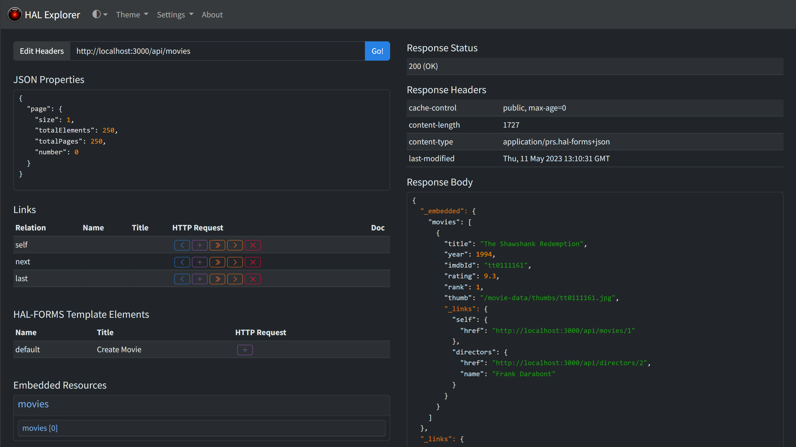

:doctype: book

image:https://github.com/toedter/hal-explorer/workflows/Build/badge.svg["build", link="https://github.com/toedter/hal-explorer/actions"]
image:https://codecov.io/gh/toedter/hal-explorer/branch/main/graph/badge.svg["coverage", link="https://codecov.io/gh/toedter/hal-explorer"]
image:https://img.shields.io/maven-central/v/org.webjars/hal-explorer?color=green["maven-central", link="https://search.maven.org/artifact/org.webjars/hal-explorer"]
image:https://img.shields.io/badge/license-MIT-blue.svg["MIT", link="http://toedter.mit-license.org"]

= HAL Explorer

HAL Explorer allows you to browse and explore http://stateless.co/hal_specification.html[HAL]
and https://rwcbook.github.io/hal-forms/[HAL-FORMS] based RESTful Hypermedia APIs.
HAL Explorer was inspired by Mike Kelly's https://github.com/mikekelly/hal-browser[HAL-Browser]
and also supports Spring Profiles.

== Documentation, Demos & Cloud Deployment

Here you will find documentation for the latest release and the current snapshot,
as well as demos (with examples) for both the latest release and the current snapshot:
|===
| Release | 2.2.0 | https://toedter.github.io/hal-explorer/release/reference-doc/[Reference Documentation] | https://toedter.github.io/hal-explorer/release/hal-explorer/#theme=Cosmo&uri=examples/examples.hal-forms.json[HAL Explorer Demo]
| Snapshot | 2.2.1-SNAPSHOT | https://toedter.github.io/hal-explorer/snapshot/reference-doc/[Reference Documentation] | https://toedter.github.io/hal-explorer/snapshot/hal-explorer/#theme=Cosmo&uri=examples/examples.hal-forms.json[HAL Explorer Demo]
|===

You can also find the current release at https://hal-explorer.com.

== TL;DR

HAL Explorer (Dark Mode with Cosmo Theme):

HAL Explorer (Light Mode with Cosmo Theme):

image::./doc/img/hal-explorer-light.png[HAL Explorer Light Mode]

== Features

* Color Modes
** Dark
** Light
** Auto (automatically detects system preference)
* Available Themes
** Bootstrap 5 default theme
** All 26 https://bootswatch.com/[Bootswatch themes]
* Column Layouts
** _2 column layout_ with optional documentation
** _3 column layout_ with documentation always visible when available
* Full HTTP Method Support
** GET, POST, PUT, PATCH, DELETE operations
** HTTP OPTIONS method to discover available request options for links
** Support for both simple and templated URIs
* Request Features
** API URL and custom request headers stored as URL fragment
** Custom request headers editor
** URI template parameter editor with validation
** Keyboard shortcuts (Enter to submit, ESC to close dialogs)
* Settings
** All settings stored in local storage with `hal-explorer.` namespace
** Configurable HTTP OPTIONS usage for link discovery
** Enable all HTTP methods for HAL-FORMS links
** Scrollable documentation mode for large documentation content
* Spring Data REST Integration
** Support for Spring Data REST profiles to populate properties in the request editor
** Automatic content type detection
* HAL-FORMS Support
** Template elements displayed in response explorer (see screenshot)
** Template properties in request editor
** Options support with inline and linked values
** Multiple selection support for array properties
** Property constraint validation in request editor
* Error Handling
** Display of HAL-FORMS documents even in error responses
** Links and affordances remain accessible in error scenarios
* Response Explorer
** Syntax-highlighted JSON display
** Expandable/collapsible sections for properties, links, embedded resources
** Response status, headers, and body information
** Documentation integration (when available)

== Development Server

Run `yarn start` for a dev server. Navigate to http://localhost:4200/.
The app will automatically reload if you change any of the source files.
The development server has a built-in proxy configuration
so that all calls to `/api` are forwarded to `localhost:8080/api`
and `/docs` are forwarded to `localhost:8080/docs`.
This is convenient when you want to test a local server without having to deal with CORS.

If you run `yarn start:fs`, an additional file server is started at port 3000.
In the test-data directory, you will find some JSON examples.
Calls to `/test-data` are forwarded to `localhost:3000/test-data`.

Try it out with the URL
http://localhost:4200/#uri=/test-data/movies.hal-forms.json.

== Build

Run `yarn build` to build the project in production mode.
The build artifacts will be stored in the `dist/` directory.

== Gradle/Java Build Support

If you have Java installed, you can also build the project with Gradle.
The Gradle build will install Node.js locally in the project directory.
Run `./gradlew build` to build the project in production mode.
The build artifacts will be stored in the `dist/` directory.

== Integration in Your Backends

If you want to use a released version of HAL Explorer in a Java-based project,
you can define a dependency to the HAL Explorer WebJar.

Maven:
[source,xml]
<dependency>
    <groupId>org.webjars</groupId>
    <artifactId>hal-explorer</artifactId>
    <version>2.2.0</version>
</dependency>

Gradle:
[source,groovy]
runtimeOnly 'org.webjars:hal-explorer:2.2.0'

When you use the WebJar with Spring Boot, you can access HAL Explorer at `/webjars/hal-explorer/2.2.0/index.html`.
The easiest way to integrate the upstream version of HAL Explorer into your backend is to clone this Git repository,
do a production build, and then copy the content of the `dist/` folder to a location accessible by your backend.
When you use Spring Boot, a good location in your project's source tree would be
`src/main/resources/static/hal-explorer`.

== Running Tests

* `yarn test` runs the unit test suite against your default browser.
* `yarn test:headless` runs the unit test suite against headless Chrome.
* `yarn e2e` runs the e2e test suite against default browsers (using Playwright).

Take a look at `package.json` for more test options.

== Development

=== Git Hooks

This project uses https://typicode.github.io/husky/[Husky] to manage Git hooks:

* **Pre-commit hook**: Automatically formats staged files using Prettier via lint-staged
* **Commit-msg hook**: Validates commit messages against conventional commit standards

=== Commit Message Convention

Commit messages must follow the https://www.conventionalcommits.org/[Conventional Commits] specification.
The format is: `type(scope): subject`

Valid types are: `build`, `chore`, `ci`, `docs`, `feat`, `fix`, `perf`, `refactor`, `revert`, `style`, `test`

Examples:
[source]
----
feat: add dark mode support
fix: resolve navigation bug in sidebar
docs: update installation instructions
----

The commit message will be automatically validated when you commit.

=== Code Formatting

This project uses https://prettier.io/[Prettier] for code formatting.
Files are automatically formatted on commit, but you can also run formatting manually:

* `yarn format` - Format all source files
* `yarn format:check` - Check if files are formatted correctly

[[license]]
== License

MIT, see http://toedter.mit-license.org
